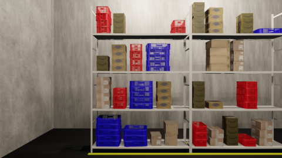
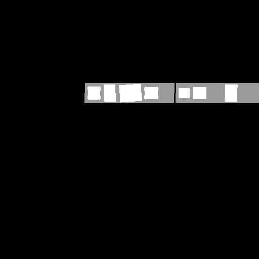
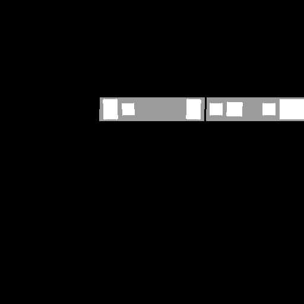

# Synthetic_warehouse
Synthetic warehouse development, rendering and applications

# Layouts
| RGB Image | Layouts  |
| ------- | --- |
|  |     |

## Assets Files

The assets file can be downloaded from <a href="https://drive.google.com/drive/folders/139RCGB8rS_euDu-1-zSx5acT5NrYqBTW?usp=sharing"> Here </a>

# Instructions to generate Layouts

* In order to generate the warehouse along with the front and top layouts just 24 images:
```
bash genrateTestDataset # for small dataset
bash genrateDataset # for Large dataset
```

* If you want to also Generate Kitti, goto Constants files and make the GENERATE_KITTI flag true
```
gedit scripts/pillared_warehouse/Constants.py
GENERATE_KITTI = True
```

* The number of images and other configs of the warehouse can be altered by changing variables in the bottom-most for loop.

## Setup
The scripts here need blender to run, and you need to have the files set up as:
```bash
├── Project Directory
│   ├── Blender
│   │   ├── blender (executable)
│   ├── Synthetic_warehouse (This repo)
│   │   ├── scripts
│   │   ├── objects (assets files)
|   |   |   ├── primitives
```
